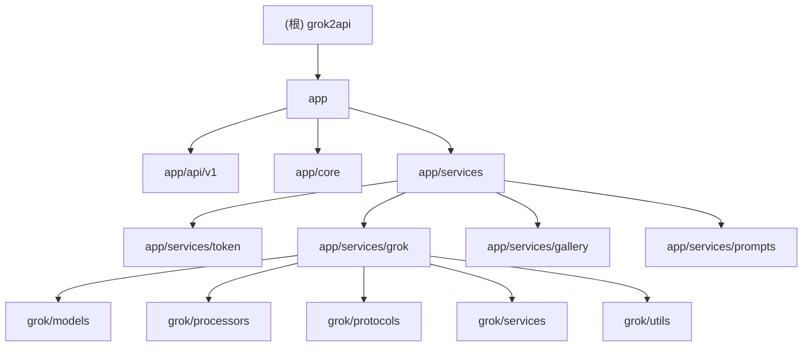

# grok2api - 项目文档

## 变更记录 (Changelog)

| 版本 | 日期 | 变更内容 |
|------|------|---------|
| 1.0.0 | 2026-02-27 | 初始生成，涵盖全部模块 |

---

## 项目愿景

grok2api 是一个将 [Grok (xAI)](https://grok.com) Web API 转换为 OpenAI 兼容格式的代理服务。
它允许任何支持 OpenAI SDK 的客户端（如 ChatGPT 客户端、LiteLLM、Open-WebUI 等）直接调用 Grok 的能力，包括：流式/非流式对话、深度思考、图片生成/编辑（WebSocket 直连）、视频生成、语音合成等。

- 版本：`1.5.0`
- 运行时：Python 3.13+，FastAPI + Uvicorn
- 存储后端：本地 TOML 文件 / Redis / MySQL / PostgreSQL（可切换）
- 部署方式：本地运行 / Docker 容器

---

## 架构总览

```
客户端 (OpenAI SDK)
      |
      v
FastAPI 应用 (main.py)
      |
      +-- app/api/v1/          # HTTP 路由层（OpenAI 兼容接口）
      |     +-- chat.py        # POST /v1/chat/completions
      |     +-- image.py       # POST /v1/images/generations & /edits
      |     +-- models.py      # GET  /v1/models
      |     +-- admin.py       # 后台管理（token、配置、批量任务）
      |     +-- gallery.py     # 图片画廊管理
      |     +-- prompt.py      # 提示词优化
      |     +-- qrcode.py      # 二维码生成
      |     +-- files.py       # 静态文件服务
      |
      +-- app/core/            # 基础设施层
      |     +-- config.py      # TOML 配置管理（深度合并、废弃迁移）
      |     +-- storage.py     # 统一存储（Local/Redis/SQL，原子写入）
      |     +-- auth.py        # Bearer Token 认证
      |     +-- exceptions.py  # OpenAI 兼容错误格式
      |     +-- logger.py      # 日志（Loguru）
      |     +-- batch_tasks.py # 批量任务（SSE 进度推送）
      |     +-- response_middleware.py # TraceID + 请求日志
      |
      +-- app/services/        # 业务服务层
            +-- token/         # Token 池管理、配额调度、自动刷新
            +-- grok/          # Grok 协议适配（HTTP/WebSocket/gRPC-Web）
            |     +-- models/  # 模型注册表
            |     +-- processors/ # 流/非流响应处理器
            |     +-- protocols/ # gRPC-Web 协议工具
            |     +-- services/ # Chat/Image/Video/Voice/Usage/Assets
            |     +-- utils/   # 重试、Headers、Statsig、Stream 工具
            +-- gallery/       # 图片元数据存储、质量评分、EXIF 管理
            +-- prompts/       # 提示词库管理
```

---

## 模块结构图



---

## 模块索引

| 路径 | 职责 | 文档 |
|------|------|------|
| `app/api/v1/` | OpenAI 兼容 HTTP 路由，请求解析与验证 | [AGENTS.md](./app/api/v1/AGENTS.md) |
| `app/core/` | 配置、存储、认证、异常、中间件等基础设施 | [AGENTS.md](./app/core/AGENTS.md) |
| `app/services/token/` | Token 池、配额管理、自动刷新调度器 | [AGENTS.md](./app/services/token/AGENTS.md) |
| `app/services/grok/` | Grok API 协议适配（聊天/图片/视频/语音）| [AGENTS.md](./app/services/grok/AGENTS.md) |
| `app/services/gallery/` | 图片元数据管理、质量评分、EXIF 写入 | [AGENTS.md](./app/services/gallery/AGENTS.md) |
| `app/services/prompts/` | 提示词库增删改查 | 见根文档 |

---

## 运行与开发

### 前置条件

- Python 3.13+
- [uv](https://github.com/astral-sh/uv)（推荐）或 pip

### 本地运行

```bash
# 安装依赖
uv sync

# 配置（首次）
cp config.defaults.toml data/config.toml
# 编辑 data/config.toml，至少添加 token 到 data/token.json

# 启动
uv run uvicorn main:app --host 0.0.0.0 --port 8000 --reload
```

### Docker 运行

```bash
docker build -t grok2api .
docker run -d \
  -p 8000:8000 \
  -v $(pwd)/data:/app/data \
  -e SERVER_STORAGE_TYPE=local \
  grok2api
```

### 环境变量

| 变量 | 说明 | 默认值 |
|------|------|--------|
| `SERVER_STORAGE_TYPE` | 存储后端：`local` / `redis` / `mysql` / `pgsql` | `local` |
| `SERVER_STORAGE_URL` | Redis/MySQL/PostgreSQL 连接 URL | 空 |
| `DATA_DIR` | 数据目录路径 | `./data` |

### 配置文件

- `config.defaults.toml` — 带注释的默认配置基线（随代码提交）
- `data/config.toml` — 运行时覆盖配置（不提交）
- 支持配置热更新（通过管理后台 API）

### 关键配置节

```toml
[app]         # app_url, api_key, app_key, image_format
[network]     # timeout, base_proxy_url, asset_proxy_url
[security]    # cf_clearance, browser, user_agent
[chat]        # temporary, stream, thinking, max_message_length
[retry]       # max_retry, backoff 策略
[image]       # image_ws, image_ws_nsfw, 质量阈值
[token]       # auto_refresh, refresh_interval_hours
[performance] # 各子系统并发上限
```

### Token 数据文件

`data/token.json` — JSON 格式，结构如下：

```json
{
  "ssoBasic": [
    {"token": "<sso_value>", "quota": 80}
  ],
  "ssoSuper": [
    {"token": "<sso_value>", "quota": 140}
  ]
}
```

- `ssoBasic`：普通用户 token，默认配额 80
- `ssoSuper`：超级用户 token，默认配额 140，用于高质量视频/高耗费模型

---

## 模型清单

| model_id | 描述 | 成本 | 类型 |
|----------|------|------|------|
| `grok-3` | Grok 3 标准模型 | LOW | chat |
| `grok-3-mini` | Grok 3 Mini（含思维链）| LOW | chat |
| `grok-3-thinking` | Grok 3 深度思考 | LOW | chat |
| `grok-4` | Grok 4 标准 | LOW | chat |
| `grok-4-mini` | Grok 4 Mini 思维链 | LOW | chat |
| `grok-4-thinking` | Grok 4 深度思考 | HIGH | chat |
| `grok-4-heavy` | Grok 4 Heavy（Super 池）| HIGH | chat |
| `grok-4.1-mini` | Grok 4.1 Mini 思维 | LOW | chat |
| `grok-4.1-fast` | Grok 4.1 Fast | LOW | chat |
| `grok-4.1-expert` | Grok 4.1 专家 | HIGH | chat |
| `grok-4.1-thinking` | Grok 4.1 深度思考 | HIGH | chat |
| `grok-imagine-1.0` | 图片生成 | HIGH | image |
| `grok-imagine-1.0-edit` | 图片编辑 | HIGH | image |
| `grok-imagine-1.0-video` | 视频生成 | HIGH | video |

---

## API 接口速查

| 方法 | 路径 | 说明 |
|------|------|------|
| POST | `/v1/chat/completions` | 流式/非流式对话（OpenAI 兼容）|
| GET  | `/v1/models` | 列出可用模型 |
| POST | `/v1/images/generations` | 图片生成 |
| POST | `/v1/images/edits` | 图片编辑（multipart/form-data）|
| GET  | `/v1/files/{media_type}/{path}` | 静态文件服务（图片/视频）|
| POST | `/v1/prompt/optimize` | 提示词优化 |
| `*`  | `/api/v1/admin/*` | 后台管理（token/config/gallery）|

---

## 测试策略

- **当前状态**：项目暂无测试目录（已在 `.gitignore` 中排除 `test_*.py`）
- **建议覆盖优先级**：
  1. `app/core/config.py` — 配置合并/迁移逻辑
  2. `app/services/token/models.py` — 配额消耗/状态机
  3. `app/services/grok/processors/` — 流处理器
  4. `app/api/v1/` — 路由参数验证（Pydantic 模型）

---

## 编码规范

- 语言：Python 3.13，使用 `tomllib`（标准库）、`pydantic v2`、`orjson`
- 格式化/Lint：`ruff`（见 `pyproject.toml [dependency-groups.dev]`）
- 错误返回：OpenAI 兼容错误格式（`{"error": {...}}`）
- 日志：Loguru，带 TraceID 的结构化日志
- 异步：全异步 I/O（FastAPI + asyncio），不阻塞事件循环

---

## AI 使用指引

- 所有对 Grok API 的请求走 `app/services/grok/services/chat.py` 的 `GrokChatService.chat()`
- Token 选择逻辑：`app/services/token/manager.py` → `app/services/token/pool.py`
- 配置读取统一使用 `get_config("section.key")` 函数
- 存储操作统一通过 `get_storage()` 工厂获取后端实例
- 新增路由：在 `app/api/v1/` 新建文件，在 `main.py` 中 `include_router`
- 新增模型：在 `app/services/grok/models/model.py` 的 `ModelService.MODELS` 列表中追加 `ModelInfo`
- 配置新增项：先在 `config.defaults.toml` 添加默认值，再通过 `register_defaults()` 注册

---
